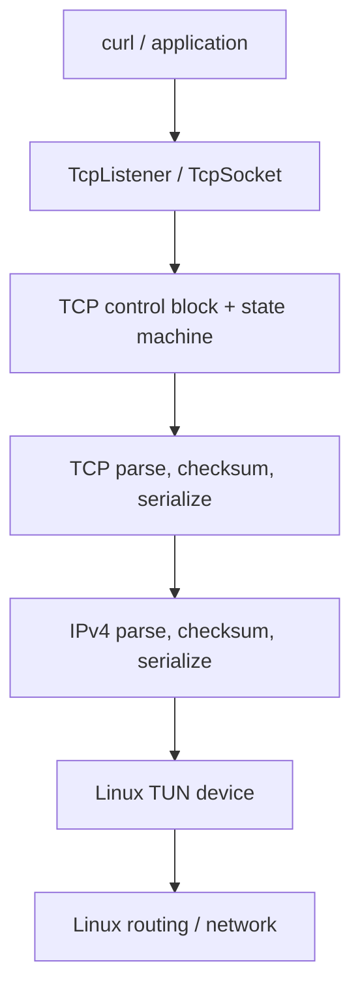
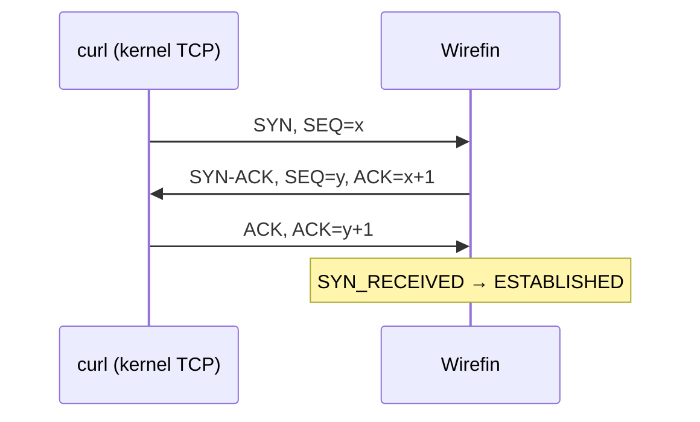

# Wirefin

Wirefin is an observable, educational userspace IPv4/TCP stack for Linux TUN,
written in Java 21. It parses and emits real packets, owns the TCP state and
sequence spaces, retransmits unacknowledged segments, and serves a small HTTP/1.1
response without `Socket`, `ServerSocket`, Netty, or the kernel TCP transport.

> **Status:** experimental and deliberately narrow. The packet-level integration
> suite verifies the complete HTTP flow in memory. Live TUN testing requires Linux;
> see [Run on Linux](#run-on-linux).

## Why userspace TCP?

TCP normally lives in the kernel so every process can share a mature, privileged,
high-performance network implementation. The kernel owns timers, routing, packet
I/O, congestion control, and the socket API. Reimplementing a subset in userspace
makes normally hidden mechanisms—sequence arithmetic, cumulative ACKs, receive
windows, retransmission, reassembly, and teardown—directly inspectable. Production
systems also use userspace networking for experimentation, isolation, specialized
latency/throughput goals, or kernel bypass. Wirefin's goal is understanding and
correctness, not replacing the host stack.

## What is TUN?

A Linux TUN device is a virtual layer-3 interface. Reading its file descriptor
returns complete IP packets; writing injects complete IP packets into the Linux
network path. Unlike TAP, TUN carries no Ethernet header. Wirefin uses JNA only to
open `/dev/net/tun`, issue `TUNSETIFF`, and call `read`/`write`. All IPv4 and TCP
logic remains Java code in this repository.

## Architecture



The core `PacketProcessor` is a pure packet-in/packet-out component. It does not
know about TUN, root privileges, or kernel sockets, which makes real protocol
paths deterministic in tests. `TcpStack` is the small runtime that connects it to
a `PacketDevice` and a scheduled retransmission poller.

## Packet lifecycle

1. `TunDevice.read()` returns one raw IPv4 packet.
2. `Ipv4Codec` validates version, IHL, total length, checksum, and extracts the
   payload. Non-TCP, fragmented, wrong-destination, and malformed packets are dropped.
3. `TcpCodec` validates the data offset and pseudo-header checksum and returns a
   `TcpSegment`.
4. `PacketProcessor` looks up the local/remote four-tuple. A SYN for a listening
   port creates a `TcpConnection`; an unopened port receives RST.
5. The connection state machine processes sequence/ACK/window/data/FIN state and
   produces zero or more response segments.
6. TCP and IPv4 codecs serialize each response and `TcpStack` writes it to TUN.

## TCP behavior

### Handshake



Wirefin currently implements passive open. The initial send sequence is random in
the runtime and injectable in tests. SYN and FIN each consume one sequence number.

### Sequence numbers and ACK processing

TCP uses a wrapping 32-bit sequence space. `SequenceNumber` implements serial
arithmetic instead of ordinary signed/unsigned comparisons. `SND.UNA`, `SND.NXT`,
and `RCV.NXT` live in the connection control block. ACKs outside `[SND.UNA,SND.NXT]`
are ignored; valid cumulative ACKs release all fully acknowledged transmissions.
Duplicate ACKs are counted for observability.

### Ordered delivery and flow control

In-order payload is delivered to the application queue and advances `RCV.NXT`.
Future exact-start segments are buffered and drained when a gap closes. Old
segments are recognized as duplicates and re-ACKed. The sender limits new data to
both the peer's advertised receive window and the congestion window. The current
blocking API deliberately rejects writes that cannot fit atomically rather than
silently exposing a partial write.

### Retransmission and congestion control

Every sequence-consuming outbound segment is retained until cumulatively ACKed.
The initial retransmission timeout is one second and doubles on each timeout up to
60 seconds. This first implementation does not estimate RTT. `BasicCongestionController`
starts at one 1400-byte MSS, uses slow start then additive increase, halves the
slow-start threshold on loss, and returns `cwnd` to one MSS. The interface keeps
future algorithms replaceable.

### Connection teardown

Both peer FIN and application close are represented in the explicit state machine:
`ESTABLISHED`, `FIN_WAIT_1`, `FIN_WAIT_2`, `CLOSE_WAIT`, `CLOSING`, `LAST_ACK`, and
`TIME_WAIT`. RST closes immediately. The current implementation enters `TIME_WAIT`
but does not yet expire and remove that control block automatically.

## Project structure

```text
src/main/java/io/github/shri299/wirefin/
├── device/       PacketDevice and Linux/JNA TunDevice
├── ipv4/         IPv4 model, codec, address, Internet checksum
├── tcp/          TCP model, flags, codec
│   ├── congestion/   controller interface and basic Reno-like algorithm
│   ├── connection/   four-tuple, table, TCP control block
│   ├── reliability/  sequence arithmetic and retransmission tracking
│   └── state/        explicit states, events, transitions
├── socket/       TcpListener and TcpSocket application API
├── runtime/      packet processor and TUN event loop
└── examples/     HTTP/1.1 server
```

Tests mirror the main packages. `HttpFlowIntegrationTest` simulates the entire
client packet conversation and exercises the public socket-like API.

## Build and test

Requirements: JDK 21+ and Maven 3.9+.

```bash
mvn clean verify
```

This creates the runnable fat JAR:

```text
target/wirefin-0.1.0-SNAPSHOT-all.jar
```

The tests never create a kernel TCP socket and do not require root or Linux.

## Run on Linux

Install TUN support if your distribution does not load it automatically:

```bash
sudo modprobe tun
```

Create a persistent interface owned by the current user, give the Linux/curl side
`10.0.0.1`, and bring it up:

```bash
sudo ip tuntap add dev tun0 mode tun user "$USER"
sudo ip address add 10.0.0.1/24 dev tun0
sudo ip link set dev tun0 up
ip route get 10.0.0.2
```

Start Wirefin (no `sudo` is needed because the interface belongs to the user):

```bash
java -jar target/wirefin-0.1.0-SNAPSHOT-all.jar \
  --tun tun0 --address 10.0.0.2 --port 8080 --debug
```

In another terminal:

```bash
curl --http1.1 --max-time 5 http://10.0.0.2:8080/
```

Expected body:

```text
Hello from userspace TCP
```

Clean up when finished:

```bash
sudo ip tuntap del dev tun0 mode tun
```

## Inspect packets

Capture the live exchange with tcpdump:

```bash
sudo tcpdump -i tun0 -nn -vvv -X 'tcp port 8080'
```

Or save a capture for Wireshark and correlate its SEQ/ACK values with `--debug` logs:

```bash
sudo tcpdump -i tun0 -nn -s 0 -w wirefin.pcap 'tcp port 8080'
wireshark wirefin.pcap
```

You should see SYN, SYN-ACK, ACK, the HTTP request/response payloads, and FIN/ACK
teardown. If no SYN appears, verify `ip route get 10.0.0.2` selects `tun0`.

## Source walkthrough of a curl request

1. **SYN:** `TcpStack.run` reads the packet. `PacketProcessor.process` invokes both
   codecs, recognizes port 8080, creates a `TcpConnection`, and returns `synAck()`.
2. **SYN-ACK:** the connection records its SYN as unacknowledged; the processor
   serializes TCP with the IPv4 pseudo-header checksum, wraps it in IPv4, and writes it.
3. **ACK:** `TcpConnection.receive` validates `ACK == SND.NXT`, clears the SYN,
   transitions `SYN_RECEIVED → ESTABLISHED`, and enqueues the connection for `accept()`.
4. **HTTP request:** sequence-valid bytes enter the application receive queue,
   `RCV.NXT` advances, and Wirefin emits a cumulative ACK. `HttpServer` reads bytes
   from `TcpSocket` until the header terminator.
5. **HTTP response:** `TcpSocket.write` segments the response, constrained by
   receive and congestion windows. Each segment is tracked before being emitted.
6. **FIN:** closing the socket transitions to `FIN_WAIT_1` and emits a tracked FIN.
   The peer ACK moves to `FIN_WAIT_2`; its FIN is ACKed and moves Wirefin to `TIME_WAIT`.

## Supported subset

- IPv4 header/options parse and serialization, checksum generation/validation
- TCP header/options parse and serialization, IPv4 pseudo-header checksum
- Passive server handshake and RST for unopened ports
- Wrapping sequence arithmetic and cumulative ACK validation
- Ordered byte delivery, exact-start out-of-order buffering, duplicate detection
- Receive-window flow control and simple send-window enforcement
- RTO retransmission with exponential backoff
- Reno-like slow start, congestion avoidance, and timeout loss response
- FIN/ACK close states and RST handling
- Blocking listener/socket abstraction and HTTP/1.1 demo
- Debug logging and packet-level integration tests

## Deliberately unsupported / incomplete

- IPv6, UDP, IP fragmentation/reassembly, routing, ICMP, ARP, and raw Ethernet
- Active TCP open/client API and simultaneous open
- TCP timestamps, SACK, window scaling, ECN behavior, urgent data, and Nagle
- Overlapping/partially duplicate segment normalization and receive-buffer limits
- RTT sampling (SRTT/RTTVAR), fast retransmit/recovery, persist/keepalive timers
- Automatic TIME_WAIT expiration, SYN cookies, listen backlog limits
- Large blocking writes that span a closed window (current writes are atomic)
- Production hardening, security review, or high-performance buffer management

## Roadmap

1. Add live network-namespace tests in a Linux CI runner.
2. Add SRTT/RTTVAR RTO calculation and Karn's algorithm.
3. Implement bounded receive buffers, partial-overlap reassembly, and zero-window probes.
4. Expire TIME_WAIT entries and harden simultaneous close.
5. Add MSS negotiation, window scaling, SACK, and fast retransmit/recovery.
6. Add active open and a userspace TCP client API.
7. Explore buffer pools, off-heap buffers, batching, and event-loop alternatives.

## RFC references

- [RFC 791: Internet Protocol](https://www.rfc-editor.org/rfc/rfc791)
- [RFC 1071: Computing the Internet Checksum](https://www.rfc-editor.org/rfc/rfc1071)
- [RFC 9293: Transmission Control Protocol](https://www.rfc-editor.org/rfc/rfc9293)
- [RFC 6298: Computing TCP's Retransmission Timer](https://www.rfc-editor.org/rfc/rfc6298)
- [RFC 5681: TCP Congestion Control](https://www.rfc-editor.org/rfc/rfc5681)

Wirefin intentionally implements a teaching subset; RFC references describe the
target behavior but do not imply full conformance.

## License

MIT
