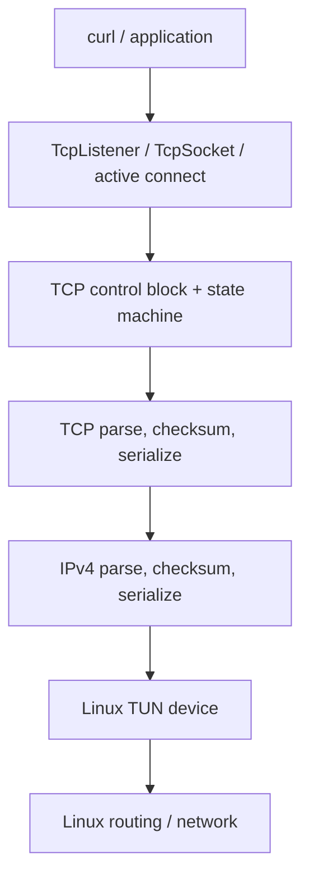
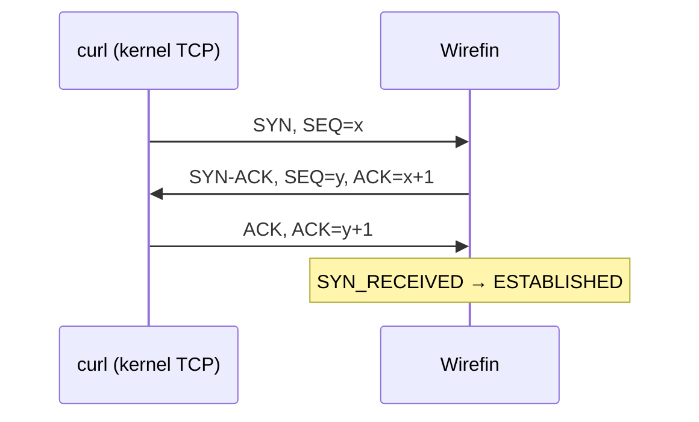
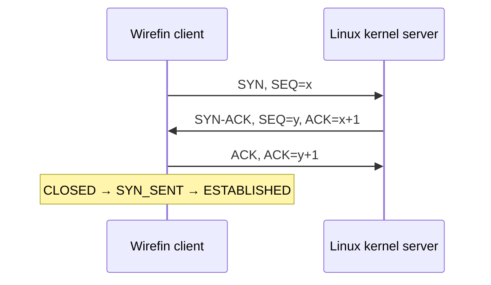
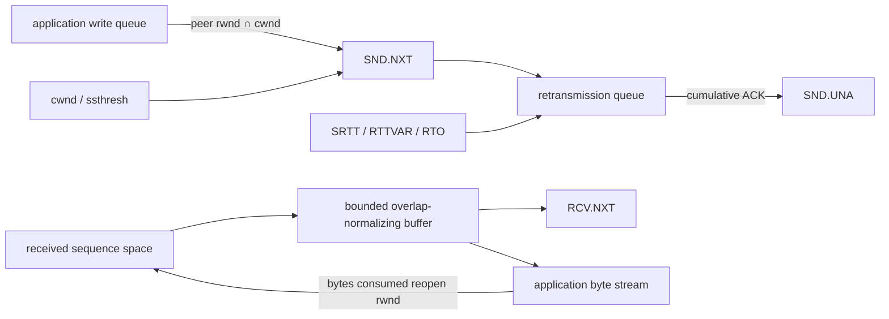

# Wirefin

[](https://github.com/shri299/wirefin/actions/workflows/ci.yml)

[](LICENSE)

Wirefin is an observable, educational userspace IPv4/TCP stack for Linux TUN,
written in Java 21. It parses and emits real packets, owns the TCP state and
sequence spaces, retransmits unacknowledged segments, and serves a small HTTP/1.1
response without `Socket`, `ServerSocket`, Netty, or the kernel TCP transport.

> **Status:** experimental and deliberately narrow. Deterministic tests verify the
> packet and control-block paths. A separate privileged Linux job and
> `scripts/integration-test-linux.sh` exercise real kernel TCP, TUN, curl, and
> tcpdump; consult the CI badge rather than assuming interoperability from unit tests.

## Why userspace TCP?

TCP normally lives in the kernel so every process can share a mature, privileged,
high-performance network implementation. The kernel owns timers, routing, packet
I/O, congestion control, and the socket API. Reimplementing a subset in userspace
makes normally hidden mechanisms—sequence arithmetic, cumulative ACKs, receive
windows, retransmission, reassembly, and teardown—directly inspectable. Production
systems also use userspace networking for experimentation, isolation, specialized
latency/throughput goals, or kernel bypass. Wirefin's goal is understanding and
correctness, not replacing the host stack.

## What is TUN?

A Linux TUN device is a virtual layer-3 interface. Reading its file descriptor
returns complete IP packets; writing injects complete IP packets into the Linux
network path. Unlike TAP, TUN carries no Ethernet header. Wirefin uses JNA only to
open `/dev/net/tun`, issue `TUNSETIFF`, and call `read`/`write`. All IPv4 and TCP
logic remains Java code in this repository.

## Architecture



The core `PacketProcessor` is a pure packet-in/packet-out component. It does not
know about TUN, root privileges, or kernel sockets, which makes real protocol
paths deterministic in tests. `TcpStack` is the small runtime that connects it to
a `PacketDevice` and a scheduled retransmission poller.

## Packet lifecycle

1. `TunDevice.read()` returns one raw IPv4 packet.
2. `Ipv4Codec` validates version, IHL, total length, checksum, and extracts the
   payload. Non-TCP, fragmented, wrong-destination, and malformed packets are dropped.
3. `TcpCodec` validates the data offset and pseudo-header checksum and returns a
   `TcpSegment`.
4. `PacketProcessor` looks up the local/remote four-tuple. A SYN for a listening
   port creates a `TcpConnection`; an unopened port receives RST.
5. The connection state machine processes sequence/ACK/window/data/FIN state and
   produces zero or more response segments.
6. TCP and IPv4 codecs serialize each response and `TcpStack` writes it to TUN.

## TCP behavior

### Handshake



Wirefin implements both passive and active open. The initial send sequence is
random in the runtime and injectable in tests. SYN and FIN each consume one
sequence number. Listener queues bound half-open plus established-but-unaccepted
connections; optional educational SYN cookies avoid allocating a control block
for overflow SYNs, at the cost of not preserving advanced peer options in cookies.



### Sequence numbers and ACK processing

TCP uses a wrapping 32-bit sequence space. `SequenceNumber` implements serial
arithmetic instead of ordinary signed/unsigned comparisons. `SND.UNA`, `SND.NXT`,
and `RCV.NXT` live in the connection control block. ACKs outside `[SND.UNA,SND.NXT]`
are ignored; valid cumulative ACKs release all fully acknowledged transmissions.
Three qualifying duplicate ACKs enter NewReno-style fast recovery: `ssthresh` is
updated, `cwnd` is inflated, and the recovery point is `SND.NXT`. Additional
duplicate ACKs inflate `cwnd`; a partial ACK retransmits the next unsacked segment;
an ACK covering the recovery point exits recovery. This is an educational NewReno
subset, not a claim of complete RFC 6582 conformance.

### Ordered delivery and flow control

`ReceiveBuffer` normalizes each byte into a bounded ordered interval space, so
duplicates, left/right overlaps, spanning segments, and out-of-order data cannot
deliver a byte twice. Its advertised window is capacity minus application-readable
and out-of-order bytes; application reads reopen the window and emit an update ACK.
The send side queues writes and emits MSS-sized data as the peer window and `cwnd`
permit. SYN MSS options constrain the effective send MSS.

If a peer advertises a zero window, queued bytes remain unassigned. A bounded,
exponentially backed-off persist timer emits one-byte probes and normal sending
resumes on a non-zero window update. RFC 7323 Window Scale is negotiated only in
SYNs and applied only to later window fields; receive buffers may therefore exceed
65,535 bytes.

### Negotiated options and SACK

Wirefin negotiates Window Scale, timestamps, and SACK Permitted during the
handshake. Negotiated timestamps are emitted and `TSval` is echoed as `TSecr`.
Out-of-order receive ranges generate up to four SACK blocks (three when timestamp
space is also required). The sender maintains a SACK scoreboard and avoids
fast-retransmitting fully SACKed segments. It does not implement production-grade
RFC 6675 SACK loss recovery.

### Retransmission and congestion control

Every sequence-consuming outbound segment is retained until cumulatively ACKed.
`RtoEstimator` implements RFC 6298-style `SRTT`, `RTTVAR`, bounded `RTO`, timeout
backoff, and Karn's rule for retransmitted data. The retransmission timer follows
the oldest outstanding segment and partial ACKs trim its payload. The basic
RFC 5681-inspired controller implements slow start, additive increase, timeout
collapse, and the NewReno-style recovery behavior described above. Timeout loss
always exits fast recovery and remains separate from duplicate-ACK loss handling.

### Connection teardown

Both peer FIN and application close are represented in the explicit state machine:
`ESTABLISHED`, `FIN_WAIT_1`, `FIN_WAIT_2`, `CLOSE_WAIT`, `CLOSING`, `LAST_ACK`, and
`TIME_WAIT`. An exact-sequence RST closes an established connection; other
in-window resets receive a challenge ACK and out-of-window resets are ignored.
A configurable timer expires `TIME_WAIT` and
atomically removes the four-tuple; retransmitted FINs are re-ACKed and refresh it.

### The TCP control block



- `SND.UNA` is the oldest unacknowledged sequence; cumulative ACKs advance it.
- `SND.NXT` is the next sequence assigned to queued application bytes or FIN.
- `RCV.NXT` is the next byte required for contiguous application delivery.
- The peer receive window and local congestion window jointly gate new sends.
- The retransmission queue retains sequence-consuming segments and timestamps;
  the oldest entry drives RTO and three duplicate ACKs drive fast retransmit.
- The bounded receive buffer owns advertised-window accounting. Data remains
  charged whether it is out of order or waiting for the application to consume it.

## Project structure

```text
src/main/java/io/github/shri299/wirefin/
├── device/       PacketDevice and Linux/JNA TunDevice
├── ipv4/         IPv4 model, codec, address, Internet checksum
├── tcp/          TCP model, flags, codec
│   ├── congestion/   controller interface and basic RFC 5681-inspired AIMD
│   ├── connection/   four-tuple, table, TCP control block
│   ├── reliability/  sequence arithmetic and retransmission tracking
│   └── state/        explicit states, events, transitions
├── socket/       TcpListener and TcpSocket application API
├── runtime/      packet processor and TUN event loop
└── examples/     HTTP/1.1 server and active-open client
```

Tests mirror the main packages. `HttpFlowIntegrationTest` simulates the entire
client packet conversation and exercises the public socket-like API.

## Build and test

Requirements: JDK 21+ and Maven 3.9+.

```bash
mvn clean verify
```

This creates the runnable fat JAR:

```text
target/wirefin-0.1.0-SNAPSHOT-all.jar
```

The default Maven tests never create a kernel TCP socket and do not require root
or Linux. The separate Linux interoperability harness tests both curl against the
Wirefin server and the Wirefin client against a normal Linux TCP server.

Run the real Linux kernel/TUN test (requires `sudo`, TUN, iproute2, curl, and tcpdump):

```bash
bash scripts/integration-test-linux.sh
```

## Run on Linux

Install TUN support if your distribution does not load it automatically:

```bash
sudo modprobe tun
```

Create a persistent interface owned by the current user, give the Linux/curl side
`10.0.0.1`, and bring it up:

```bash
sudo ip tuntap add dev tun0 mode tun user "$USER"
sudo ip address add 10.0.0.1/24 dev tun0
sudo ip link set dev tun0 up
ip route get 10.0.0.2
```

Start Wirefin (no `sudo` is needed because the interface belongs to the user):

```bash
java -jar target/wirefin-0.1.0-SNAPSHOT-all.jar \
  --tun tun0 --address 10.0.0.2 --port 8080 --debug
```

In another terminal:

```bash
curl --http1.1 --max-time 5 http://10.0.0.2:8080/
```

Expected body:

```text
Hello from userspace TCP
```

To exercise active open against a server on `10.0.0.1:8081`, run the packet loop
through the client example:

```bash
java -cp target/wirefin-0.1.0-SNAPSHOT-all.jar \
  io.github.shri299.wirefin.examples.HttpClient \
  --tun tun0 --address 10.0.0.2 --remote 10.0.0.1 --port 8081
```

Clean up when finished:

```bash
sudo ip tuntap del dev tun0 mode tun
```

## Inspect packets

Capture the live exchange with tcpdump:

```bash
sudo tcpdump -i tun0 -nn -vvv -X 'tcp port 8080'
```

Or save a capture for Wireshark and correlate its SEQ/ACK values with `--debug` logs:

```bash
sudo tcpdump -i tun0 -nn -s 0 -w wirefin.pcap 'tcp port 8080'
wireshark wirefin.pcap
```

You should see SYN, SYN-ACK, ACK, the HTTP request/response payloads, and FIN/ACK
teardown. The integration script asserts those flags in its captured pcap. If no
SYN appears, verify `ip route get 10.0.0.2` selects `tun0`.

## Source walkthrough of a curl request

1. **SYN:** `TcpStack.run` reads the packet. `PacketProcessor.process` invokes both
   codecs, recognizes port 8080, creates a `TcpConnection`, and returns `synAck()`.
2. **SYN-ACK:** the connection records its SYN as unacknowledged; the processor
   serializes TCP with the IPv4 pseudo-header checksum, wraps it in IPv4, and writes it.
3. **ACK:** `TcpConnection.receive` validates `ACK == SND.NXT`, clears the SYN,
   transitions `SYN_RECEIVED → ESTABLISHED`, and enqueues the connection for `accept()`.
4. **HTTP request:** sequence-valid bytes enter the application receive queue,
   `RCV.NXT` advances, and Wirefin emits a cumulative ACK. `HttpServer` reads bytes
   from `TcpSocket` until the header terminator.
5. **HTTP response:** `TcpSocket.write` segments the response, constrained by
   receive and congestion windows. Each segment is tracked before being emitted.
6. **FIN:** closing the socket transitions to `FIN_WAIT_1` and emits a tracked FIN.
   The peer ACK moves to `FIN_WAIT_2`; its FIN is ACKed and moves Wirefin to `TIME_WAIT`.

## TCP feature matrix

| Area | Status | Exact scope |
|---|---|---|
| IPv4/TCP wire format | Implemented | Parse/serialize, checksums, four-tuple demultiplexing; no IP fragments |
| Open | Implemented | Passive open and active `connect`, SYN retransmission/refusal, ephemeral ports |
| Listener protection | Implemented subset | Bounded backlog and optional stateless cookies with reduced option fidelity |
| Byte stream | Implemented | Bounded overlap normalization, ordered reads, queued MSS-sized writes |
| Flow control | Implemented subset | Dynamic/scaled windows, persist timer and probes; no full persist-state machine |
| Options | Implemented subset | MSS, Window Scale, timestamps, SACK Permitted and SACK blocks |
| Retransmission | Implemented | RFC 6298-style SRTT/RTTVAR/RTO, Karn sampling and backoff |
| Congestion | Implemented subset | Slow start, additive increase, timeout loss, NewReno-style fast recovery |
| SACK sender | Partial | Scoreboard and unsacked retransmit selection; not RFC 6675 recovery |
| Reset defense | Implemented subset | Exact-sequence acceptance and challenge ACK for other in-window RSTs |
| Close | Implemented | Active/passive/simultaneous close, FIN retransmit, timer-driven TIME_WAIT |
| Interoperability | Tested | Kernel curl → Wirefin server and Wirefin client → kernel server over Linux TUN |

## Deliberately unsupported / incomplete

- IPv6, UDP, IP fragmentation/reassembly, routing, ICMP, ARP, and raw Ethernet
- Simultaneous open, TCP Fast Open, ECN, urgent data, Nagle, and keepalives
- PAWS timestamp rejection, timestamp-derived RTT sampling, and full RFC 7323 behavior
- RFC 6675 SACK loss recovery and complete RFC 6582 NewReno edge-case coverage
- Full RFC 5961 reset processing and cryptographic/option-rich production SYN cookies
- A dedicated bounded send buffer and blocking application backpressure
- Blocking application backpressure when the in-memory send queue itself is bounded
- Production hardening, security review, or high-performance buffer management

## Roadmap

1. Add fault injection for loss, reordering, duplicate ACKs, zero-window recovery, and option combinations.
2. Complete RFC 6675 SACK recovery, PAWS, and remaining NewReno edge cases.
3. Bound the application send queue and add blocking backpressure semantics.
4. Harden cookies/backlogs under adversarial load and add property-based/fuzz testing.
5. Run an interoperability matrix across Linux kernel versions before adding another protocol.

## RFC references

- [RFC 791: Internet Protocol](https://www.rfc-editor.org/rfc/rfc791)
- [RFC 1071: Computing the Internet Checksum](https://www.rfc-editor.org/rfc/rfc1071)
- [RFC 9293: Transmission Control Protocol](https://www.rfc-editor.org/rfc/rfc9293)
- [RFC 6298: Computing TCP's Retransmission Timer](https://www.rfc-editor.org/rfc/rfc6298)
- [RFC 5681: TCP Congestion Control](https://www.rfc-editor.org/rfc/rfc5681)
- [RFC 6582: NewReno Modification](https://www.rfc-editor.org/rfc/rfc6582)
- [RFC 7323: TCP Extensions for High Performance](https://www.rfc-editor.org/rfc/rfc7323)
- [RFC 2018: TCP Selective Acknowledgment Options](https://www.rfc-editor.org/rfc/rfc2018)
- [RFC 5961: Improving TCP's Robustness to Blind In-Window Attacks](https://www.rfc-editor.org/rfc/rfc5961)

Wirefin intentionally implements a teaching subset; RFC references describe the
target behavior but do not imply full conformance.

## License

MIT
