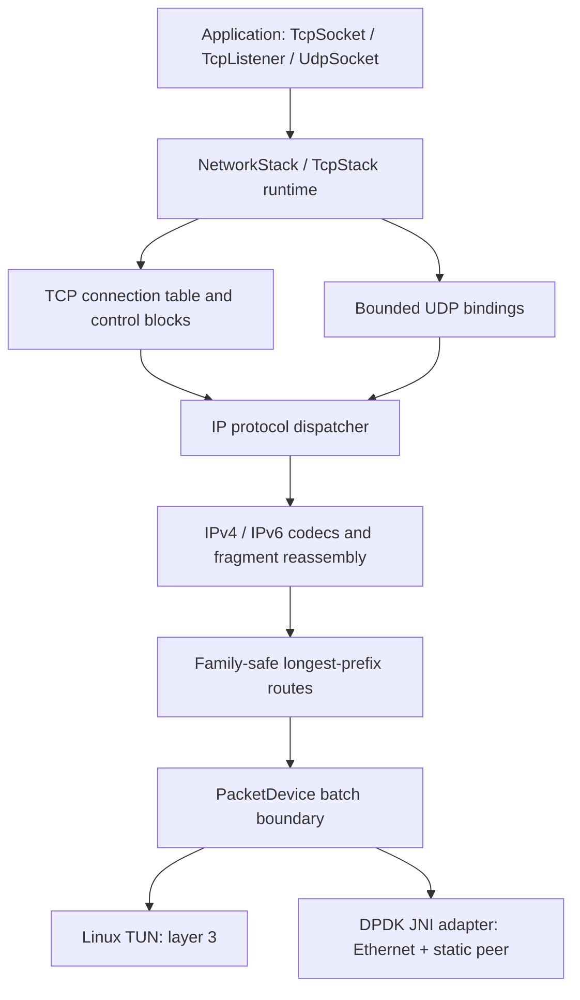
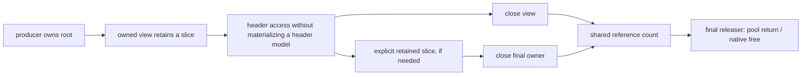
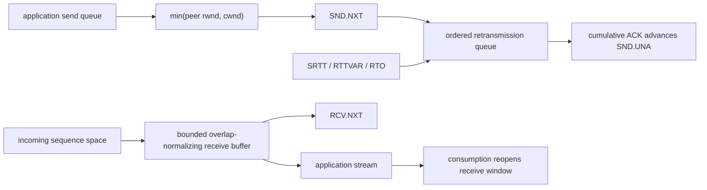
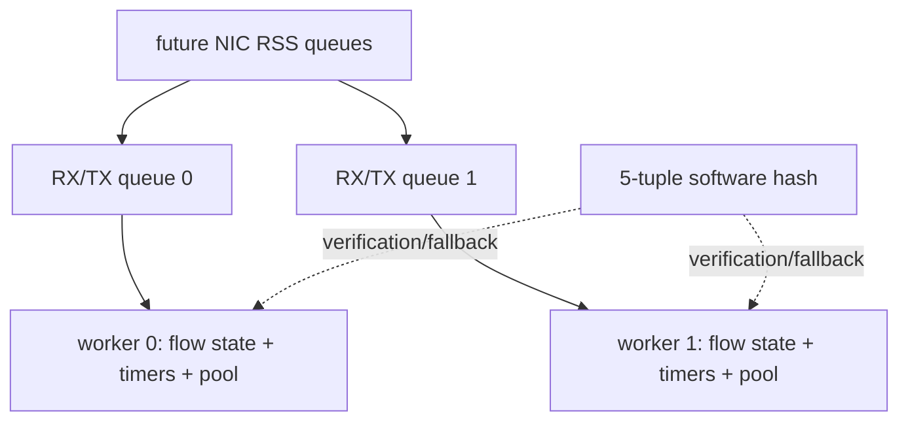

# Wirefin architecture

Wirefin is a bounded, observable, educational userspace IPv4/IPv6 stack. The
same protocol core runs behind Linux TUN and an experimental DPDK/JNI adapter.
The design favors protocol clarity and explicit evidence over breadth. It is not
a Linux networking replacement and does not claim complete RFC conformance.

## System boundary and data flow

`PacketProcessor` is the deterministic packet-in/packet-out core. It has no TUN,
JNI, root, or kernel-socket dependency. `TcpStack` owns a device, the processor,
capture/trace sinks, and a 100 ms timer poll. The public socket-like objects
delegate to connection/application queues; they do not call the kernel transport
stack.

## Packet and memory ownership

The compatibility data plane currently passes immutable `byte[]` packets through
`PacketBatch`. `PacketMemory` adds storage-neutral heap, direct, or externally
released roots with reference-counted slices and checked close semantics.
`OwnedPacketView` and its Ethernet/IP/TCP/UDP views retain this owner until closed.
Borrowed `ByteBuffer` views remain separate so existing parse-only hot paths do
not pay reference-counting allocation.

Use after close, double close, invalid bounds, and premature final release throw.
The abstraction can own an externally supplied direct buffer, but the DPDK JNI
adapter does **not yet** wrap a live mbuf. RX still copies mbuf → direct arena →
Ethernet `byte[]` → IP `byte[]`; TX builds an Ethernet `byte[]` and copies it to
an mbuf. Calling this path zero-copy would be incorrect. See
`docs/PACKET_OWNERSHIP.md`.

## IPv4, IPv6, routing, UDP, and ICMP

The version nibble selects a family codec. IPv4 validates IHL, lengths, and the
header checksum; fragments enter a bounded reassembler keyed by tuple and expire.
Overlapping assemblies are rejected. IPv6 supports the fixed header only; extension
headers and IPv6 fragmentation are outside scope. `TransportChecksum` supplies
family-correct pseudo-headers.

`IpProtocolDispatcher` routes protocol numbers to TCP, UDP, ICMPv4, or ICMPv6.
UDP retains datagram boundaries and source endpoints in bounded socket queues.
Unbound UDP ports produce the family-appropriate destination-unreachable message.
ICMP implements echo and the error messages needed by the current direct-route
lab. The route table is family safe and chooses the longest prefix, although the
example runtime has one device rather than a forwarding plane.

## TCP control block and state machine

Each `TcpConnection` exclusively owns one four-tuple's mutable transport state.
Its public protocol mutations are synchronized. `TcpConnectionTable` globally
bounds entries (65,536 by default); listeners separately bound half-open and
accepted-but-unconsumed work.

The explicit state machine covers active/passive open, established transfer,
both close directions, simultaneous close, TIME_WAIT, and reset handling. SYN and
FIN consume sequence space. Sequence comparisons use 32-bit serial arithmetic,
not Java signed integer ordering.

## Reliability, flow control, and congestion control

Sequence-consuming segments remain in an oldest-first retransmission manager
until cumulatively acknowledged. RTT sampling follows Karn's rule; the estimator
uses SRTT/RTTVAR, bounded RTO, and timeout backoff. The timer poll also handles
persist and TIME_WAIT. Idle scan cost is measured at 1k/10k/100k; avoid a timing
wheel until workload profiles justify its complexity.

The receive buffer charges both application-readable and out-of-order bytes to a
fixed capacity. It normalizes duplicate and overlapping input, generates up to
four SACK blocks, and never delivers a byte twice. Window scale, timestamps, MSS,
and SACK-permitted are negotiated only in SYNs. A backed-off persist probe handles
a peer's zero window.

`CongestionController` separates window/recovery policy from the TCB. The default
`BasicCongestionController` is an RFC-5681-inspired NewReno subset: slow start,
additive increase, timeout collapse, duplicate-ACK fast retransmit, partial ACK
handling, and recovery exit. `CubicCongestionController` is an optional educational
strategy with time-aware cubic target growth, a TCP-friendly additive floor, and
0.7 multiplicative decrease. It deliberately reuses NewReno-style recovery and
does not implement every RFC 9438/Linux heuristic. Select either with
`--congestion-control reno|cubic` and compare only with recorded netem results.

## Backends and event loops

TUN is the correctness backend. One Java packet loop reads batches, runs every
packet through the shared core, and writes response batches. A scheduled thread
polls connection timers; connection synchronization also protects application
virtual threads interacting with the packet loop.

The DPDK adapter initializes EAL, one mempool, and exactly one RX/TX queue pair.
JNI calls `rte_eth_rx_burst`/`rte_eth_tx_burst`; Java currently supplies static
local/peer MAC addresses. Safe scripts require an explicit PCI BDF, validate
IOMMU/hugepages, refuse a default-route interface by default, retain its driver,
and restore it later.

Multi-queue workers, RSS programming, stable software flow sharding, and
NUMA-local pools are design targets, not implemented properties:

A future implementation should keep a connection on one worker and avoid global
hot-path locks. NIC RSS configuration must be verified against the same tuple
definition. On multi-node systems, queues, workers, and mempools should share a
NUMA node; on single-node systems configuration must degrade to normal placement.
No scaling or NUMA claim is made without suitable hardware measurements.

## Observability and failure containment

`NetworkMetrics` exposes packet/byte/drop rates, lifecycle and recovery counters,
protocol traffic, malformed/checksum rejection, fragment events, queue/pool state,
and resource rejection. Detailed protocol counters are opt-in to preserve the
default packet path. `TcpConnectionSnapshot` is an immutable, read-only TCB view
used by `TcpStack.connections()`.

Optional JSONL tracing records direction, stable connection ID, state, SEQ/ACK,
cwnd, peer window, RTT/RTO, and retransmission count. Optional PCAPNG capture
records raw-IP RX/TX interfaces, timestamps, and direction flags. Both use a
disabled singleton so no event object is constructed in the off state. They do
synchronous file I/O when enabled and are diagnostic—not benchmark—modes.

Externally controlled parsers reject malformed bounds and checksums. Connection,
listener, send, receive, UDP, fragment, packet-pool, and batch capacities prevent
unbounded retention. Exceptions release owned packet roots through final-close
semantics. Property tests, deterministic parser fuzzing, resource floods, Linux
interoperability, netem labs, and same-host benchmarks provide complementary
evidence; the exact level for each protocol is in `docs/PROTOCOL_SUPPORT.md`.
