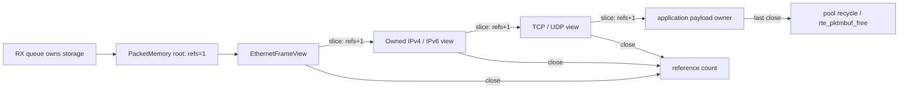

# Packet-memory ownership

`PacketMemory` is the lifetime boundary for packet storage that may be heap-backed,
direct, pooled, or eventually backed by a DPDK mbuf. Creating a root transfers one
reference to its caller. Every slice owns an additional reference. Each root or
slice must be closed exactly once; the backing releaser runs only after the final
reference closes.

The implementation rejects access after release and duplicate close. It never
exposes the mutable backing `ByteBuffer`, which prevents Java code from retaining
an unchecked alias after recycling. A native DPDK adapter can attach a batched
mbuf-release callback through `PacketMemory.takeOwnership(ByteBuffer, ..., releaser)`;
that adapter is not yet implemented and no mbuf-backed claim is made.

The original borrowed `PacketView` remains a separate compact type for callers
whose outer scope owns a `ByteBuffer`. This separation is intentional. An initial
implementation added ownership fields and a branch to `PacketView`; a same-host
JMH check measured IPv4 view throughput at 35.15 Mops/s and 112 B/op versus the
previous 40.18 Mops/s and 104 B/op. That design was rejected. After separating
owned views, the confirming run measured 44.04 Mops/s and 104 B/op for IPv4 and
102.09 Mops/s and 104 B/op for IPv6. Throughput differences between the confirming
run and historical result are not claimed as improvements because they are
separate executions; allocation parity and removal of the observed regression are
the decision evidence.

## Rules

1. A method documented as transferring ownership must either return a live owner
   or release the input when parsing fails.
2. A method returning a slice gives the caller a new owner that must be closed.
3. Protocol state may retain packet memory only behind an explicit bound.
4. TX, drop, malformed-input, and exception paths must all close their owners.
5. Native storage is freed only by its registered final releaser, never directly
   by protocol code.
