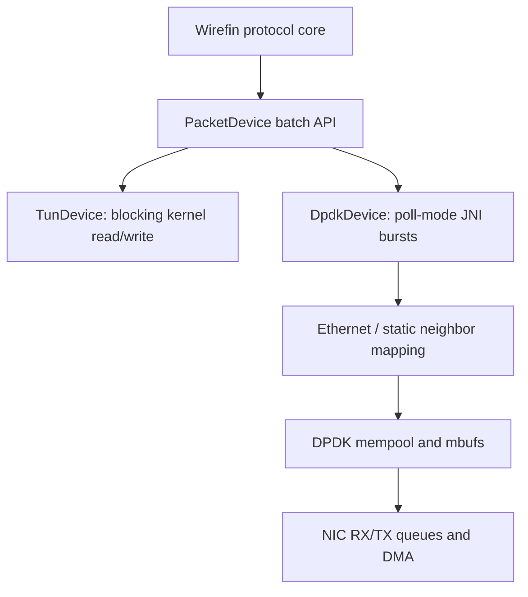

# Optional DPDK backend

`TunDevice` remains the correctness backend. `DpdkDevice` uses a minimal JNI shim
for EAL initialization, an mbuf mempool, one RX/TX queue, `rte_eth_rx_burst`, and
`rte_eth_tx_burst`. TCP/IP code remains Java and shared by both devices.



The current JNI compatibility boundary polls mbufs into a reusable direct arena,
then copies each frame once into the existing `byte[]` protocol core. TX builds an
Ethernet frame and copies it into an mbuf. It is therefore **copy-reduced and
batched, not zero-copy**. `PacketView` demonstrates a no-payload-copy header path;
integrating mbuf lifetime with connection/application ownership remains future work.

## Ubuntu setup

Use a dedicated test NIC; binding it removes it from the normal kernel network
stack and can disconnect the machine. Record the PCI address and existing driver.

```bash
sudo apt-get update
sudo apt-get install -y build-essential pkg-config openjdk-21-jdk dpdk dpdk-dev libdpdk-dev
sudo sysctl -w vm.nr_hugepages=1024
sudo mkdir -p /mnt/huge
mountpoint -q /mnt/huge || sudo mount -t hugetlbfs nodev /mnt/huge

sudo modprobe vfio-pci
sudo dpdk-devbind.py --status
sudo ip link set dev eth1 down
sudo dpdk-devbind.py --bind=vfio-pci 0000:03:00.0
sudo dpdk-devbind.py --status
```

VFIO normally requires IOMMU support enabled in firmware and the kernel command
line. DPDK's no-IOMMU mode weakens DMA isolation and is not recommended.

Build the native shim and expose it to the JVM:

```bash
export JAVA_HOME=/usr/lib/jvm/java-21-openjdk-amd64
make -C native/dpdk clean all
mvn clean package
export LD_LIBRARY_PATH="$PWD/native/dpdk${LD_LIBRARY_PATH:+:$LD_LIBRARY_PATH}"
```

Run a bounded benchmark server. The initial backend requires an explicit peer MAC;
ARP and ICMPv6 Neighbor Discovery codecs/cache are present, but asynchronous
neighbor resolution is not yet wired into TX queueing.

```bash
java -cp target/wirefin-0.1.0-SNAPSHOT-all.jar \
  io.github.shri299.wirefin.examples.PerformanceServer \
  --backend dpdk --address 192.0.2.2 --address6 2001:db8::2 \
  --local-mac 02:00:00:00:00:02 --peer-mac 02:00:00:00:00:01 \
  --port-id 0 --batch 32 --duration 60 \
  --eal-args 'wirefin -l 1-2 --main-lcore 1 --socket-mem 1024'
```

Restore the NIC after testing:

```bash
sudo dpdk-devbind.py --bind=ixgbe 0000:03:00.0  # replace with the recorded driver
sudo ip link set dev eth1 up
```

## Reproduction and locality

```bash
JAVA_HOME=/usr/lib/jvm/java-21-openjdk-amd64 bash scripts/benchmark-jmh.sh target/jmh
sudo -E WIREFIN_BACKEND=tun WIREFIN_CPU=2 bash scripts/benchmark-linux.sh target/tun
sudo -E WIREFIN_BACKEND=dpdk WIREFIN_CPU=2 \
  DPDK_PORT_ID=0 DPDK_LOCAL_MAC=02:00:00:00:00:02 \
  DPDK_PEER_MAC=02:00:00:00:00:01 \
  DPDK_EAL_ARGS='wirefin -l 1-2 --main-lcore 1' \
  bash scripts/benchmark-linux.sh target/dpdk
```

Use the same host, NIC, traffic-generator host, MTU, duration, payload, flow count,
CPU governor, affinity, JVM and batch size for both backends. Test batch sizes such
as 1, 8, 16, 32 and 64 rather than selecting one from intuition. DPDK polling can
reduce syscall/interrupt overhead at load, but consumes a core while idle. Hugepages
back mempools with stable physically mapped memory; mbufs carry DMA-able packet
storage. Actual benefit depends on NIC, NUMA placement, cache locality and workload.
